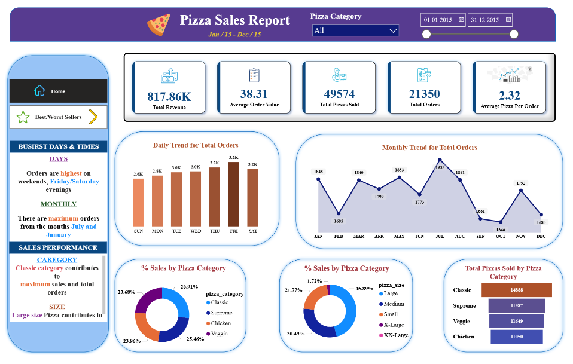
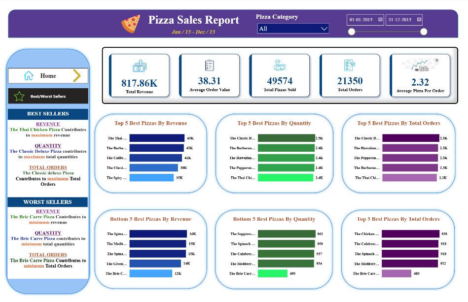

# 🍕 Pizza Sales Analysis | SQL & Power BI

## 📌 Project Overview

This project analyzes pizza sales data to uncover key business insights related to revenue, order patterns, product performance, pizza categories, sizes, and customer purchasing trends.

The project combines **SQL Server** for business analysis with **Power BI** for interactive data visualization. SQL was used to calculate KPIs and answer business questions, while Power BI was used to transform the analytical results into an interactive two-page sales dashboard.

---

## 🎯 Business Objective

The objective of this project is to analyze transactional pizza sales data and identify patterns that can support better sales and product decisions.

The analysis focuses on questions such as:

- What are the overall revenue and order performance?
- Which days and months generate the highest order volumes?
- Which pizza categories contribute the most to sales?
- Which pizza sizes generate the largest share of revenue?
- Which pizzas are the strongest performers by revenue, quantity, and orders?
- Which pizzas consistently underperform?
- What purchasing patterns can be identified from the sales data?

---

## 📊 Key Performance Indicators

| KPI | Result |
|---|---:|
| **Total Revenue** | **817.86K** |
| **Average Order Value** | **38.31** |
| **Total Pizzas Sold** | **49,574** |
| **Total Orders** | **21,350** |
| **Average Pizzas per Order** | **2.32** |

---

## 🛠️ Tech Stack

| Technology | Purpose |
|---|---|
| **SQL Server** | Data querying and business analysis |
| **SSMS** | Writing and executing SQL queries |
| **Power BI** | Interactive dashboard development |
| **Power Query** | Data preparation and transformation |
| **DAX** | KPI calculations and dashboard measures |

---

## 🔄 Analysis Workflow

```text
Pizza Sales Dataset
        ↓
Data Preparation
        ↓
SQL Server Analysis
        ↓
KPI Calculation
        ↓
Sales & Product Analysis
        ↓
Power BI Dashboard
        ↓
Business Insights
```
---
## 🧠 SQL Business Analysis

SQL Server was used to calculate business KPIs and analyze sales performance across time, pizza categories, sizes, and individual products.

### 🔹 KPI Analysis

- Total Revenue
- Average Order Value
- Total Pizzas Sold
- Total Orders
- Average Pizzas per Order

### 🔹 Sales Trend Analysis

- Analyzed daily order trends to identify the busiest days
- Analyzed monthly order trends to identify peak and low-demand periods
- Compared order activity across different days and months

### 🔹 Product & Category Analysis

- Calculated percentage contribution of each pizza category to total sales
- Calculated percentage contribution of each pizza size to total sales
- Analyzed total pizzas sold across categories

### 🔹 Best & Worst Seller Analysis

Pizzas were ranked based on three key performance measures:

- Revenue generated
- Total quantity sold
- Total number of orders

Both the **Top 5** and **Bottom 5** pizzas were analyzed to identify high-performing and underperforming products.

### 🧩 SQL Concepts Demonstrated

`SUM()` • `COUNT()` • `DISTINCT` • `GROUP BY` • `ORDER BY` • `TOP` • `DATENAME()` • `ROUND()` • Aggregations • Subqueries
---

## 💡 Key Business Insights

### 📅 Order Trends

- Order activity was highest toward the end of the week, with **Friday recording the highest order volume**.
- The dashboard identifies **Friday and Saturday evenings** as particularly busy periods.
- **July recorded the highest monthly order volume with 1,935 orders**.
- January was also among the strongest months with **1,845 orders**.

### 🍕 Category Performance

- The **Classic** category generated the largest share of sales at approximately **26.91%**.
- Supreme contributed approximately **25.46%**, followed by Chicken at **23.96%** and Veggie at **23.68%**.
- Classic also recorded the highest pizza quantity sold, with **14,888 pizzas**.

### 📏 Pizza Size Performance

- **Large pizzas dominated sales contribution at approximately 45.89%**.
- Medium pizzas contributed approximately **30.49%**.
- Small pizzas accounted for approximately **21.77%**.
- XL and XXL pizzas represented only a small proportion of overall sales.

### 🏆 Best Sellers

- **The Thai Chicken Pizza** generated the highest revenue.
- **The Classic Deluxe Pizza** recorded the highest quantity sold.
- The Classic Deluxe Pizza also generated the highest number of orders.

### 📉 Worst Seller

- **The Brie Carre Pizza** was the weakest-performing product across all three major measures:
  - Revenue
  - Quantity sold
  - Total orders

This suggests that the product consistently underperformed compared with the rest of the pizza portfolio.
---

## 📊 Power BI Dashboard

The analysis was transformed into a two-page interactive Power BI dashboard designed to provide a clear view of overall sales performance and individual product performance.

### 🏠 Sales Overview



The overview page provides a consolidated view of the major KPIs, daily and monthly order trends, category performance, pizza-size contribution, and total pizzas sold by category.

### ⭐ Best & Worst Sellers



The product-performance page compares the **Top 5 and Bottom 5 pizzas** based on revenue, quantity sold, and total orders, making it easier to identify the strongest and weakest products in the portfolio.
---

## 📂 Repository Structure

```text
pizza-sales-analysis/
│
├── images/
│   ├── PIZZA-SALES-OVERVIEW.png
│   └── PIZZA-BEST-WORST-SELLERS.png
│
├── sql_analysis_report.pdf
├── pizza_sales_dashboard.pdf
├── pizza_sales.csv
└── README.md
```
---

## 💼 Skills Demonstrated

- Writing SQL queries to answer business questions
- Calculating business KPIs using SQL
- Analyzing daily and monthly sales trends
- Performing product, category, and size-level analysis
- Identifying best-selling and underperforming products
- Using aggregations, subqueries, grouping, and ranking logic in SQL
- Building interactive dashboards in Power BI
- Designing KPI cards and business-focused visualizations
- Translating transactional sales data into actionable business insights
---

## ▶️ How to Explore the Project

1. Review **`sql_analysis_report.pdf`** to explore the SQL queries used for KPI, trend, category, size, and product analysis.
2. Open **`pizza_sales_dashboard.pdf`** to view the complete two-page Power BI dashboard.
3. Explore **`pizza_sales.csv`** to understand the underlying transactional dataset.
4. Review the key findings and dashboard screenshots summarized in this README.

> **Note:** The dashboard covers pizza sales data from January to December 2015.
---

## 👤 Author

**Sagar Gupta**  
Data Analyst | SQL • Power BI • Python • Excel

[LinkedIn](https://www.linkedin.com/in/sagar-gupta087/) • [Portfolio](https://sagar-gupta-data-analyst.framer.website/) • [GitHub](https://github.com/Sagar-Gupta008)
